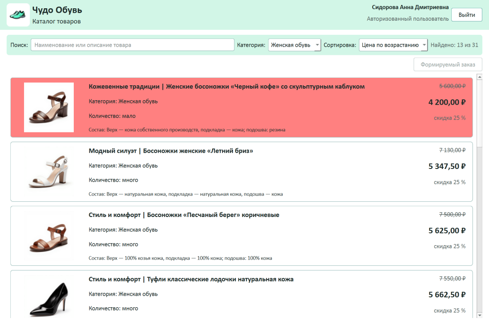
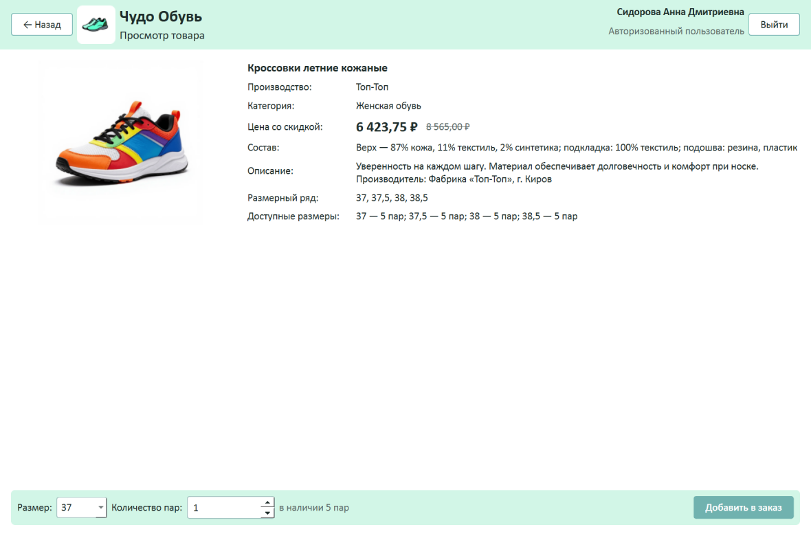
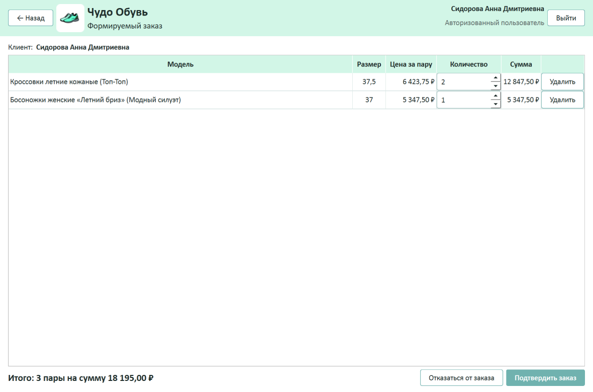
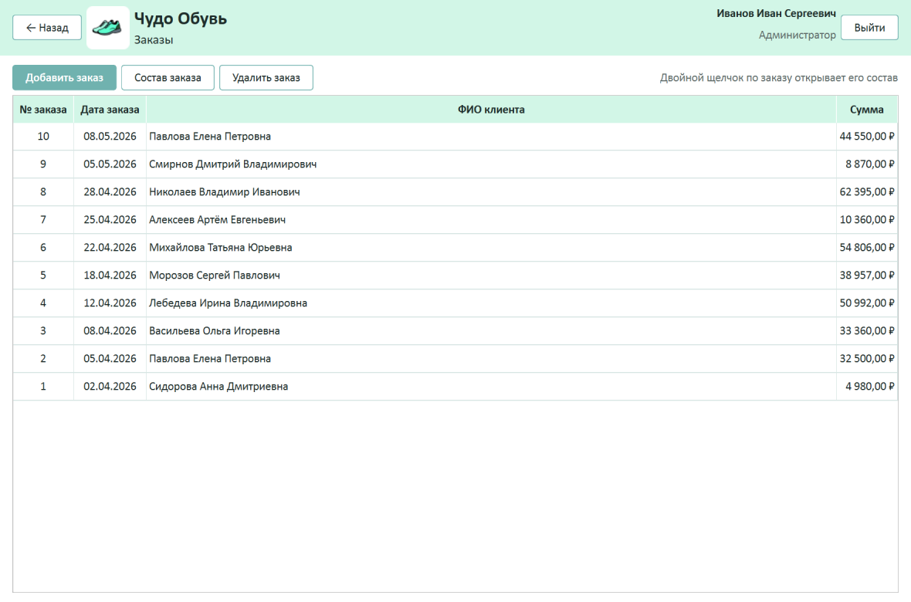
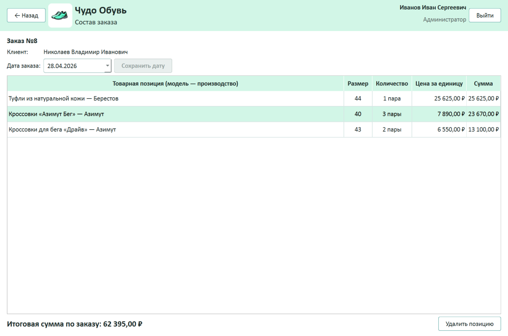
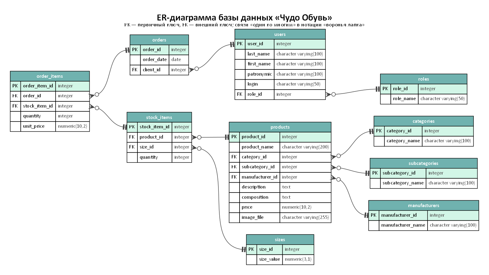

# Чудо Обувь — система оформления заказа обуви

Эталонное решение демонстрационного экзамена базового уровня
**КИМ 09.02.07-2-2027** (специальность 09.02.07 «Информационные системы
и программирование», квалификация «Программист»), задания 1–4.

Торговая компания «Чудо Обувь» продаёт обувь; система позволяет клиентам
выбрать и заказать одну или несколько пар из каталога, а менеджерам
и администраторам — работать с заказами.

| Часть              | Технологии                                             |
|--------------------|--------------------------------------------------------|
| База данных        | PostgreSQL 17                                          |
| Эталон             | Python 3.12, PySide6 6.11 (Qt), psycopg 3             |
| Продвинутая версия | C++20, Qt 6.11 (Widgets, SQL), CMake, MinGW 13.1       |

Обе версии работают с одной базой данных, выглядят и ведут себя одинаково.
Подробный разбор решения для учёбы — [docs/walkthrough.md](docs/walkthrough.md).



## Функциональность

### Роли пользователей

| Возможность                                         | Гость | Авторизованный пользователь | Менеджер | Администратор |
|-----------------------------------------------------|:-----:|:---------------------------:|:--------:|:-------------:|
| Просмотр каталога                                   |   ✓   |              ✓              |    ✓     |       ✓       |
| Поиск, фильтр по категории, сортировка по цене      |       |              ✓              |    ✓     |       ✓       |
| Оформление заказа (выбор размера и количества)      |       |    ✓ (на себя)              | ✓ (на клиента) | ✓ (на клиента) |
| Список заказов, состав заказа, добавление, удаление |       |                             |    ✓     |       ✓       |
| Редактирование заказа: дата, удаление позиций       |       |                             |          |       ✓       |

### Вход в систему

- Вход только по логину из списка пользователей, пароль не требуется;
  можно войти как гость.
- Поле логина не принимает недопустимые символы и подсказывает проверить
  раскладку, если вводится кириллица.
- После входа ФИО и роль пользователя выводятся в правом верхнем углу,
  кнопка «Выйти» возвращает на страницу входа.

### Каталог товаров (главная форма)

- Карточки по макету из задания: изображение (если его нет — картинка-заглушка
  `picture.png`), «Производство | Наименование», категория, количество,
  состав и цена.
- Количество — «много», если по всем размерам модели больше пяти пар,
  иначе «мало». Товары, которых осталось **три пары и меньше**,
  подсвечиваются цветом `#FF8080`.
- **Скидка 25 %** действует на товары, по которым не было заказов
  в предыдущем календарном месяце относительно текущей даты; в карточке
  показаны цена со скидкой и перечёркнутая базовая цена.
- Для авторизованных пользователей — поиск по наименованию и описанию,
  фильтр по категории (первый пункт «Все категории» сбрасывает фильтр)
  и сортировка по цене. Всё применяется сразу при изменении условий,
  фильтр и поиск работают совместно, выбранная сортировка сохраняется.

### Оформление заказа

- Нажатие на карточку открывает форму товара: изображение, производство,
  наименование, категория, цена со скидкой, состав, описание, размерный ряд
  и доступные для заказа размеры. Данные при открытии читаются из базы.
- Размер выбирается из доступных, количество ограничено остатком с учётом
  пар, уже добавленных в заказ.
- Формируемый заказ: изменение количества, удаление позиций, итоговая сумма.
  Менеджер и администратор выбирают клиента, авторизованный пользователь
  оформляет заказ на себя.
- Подтверждение сохраняет заказ с сегодняшней датой и списывает остатки
  **в одной транзакции**. Если товар закончился, пока заказ формировался,
  пользователь получает понятное сообщение, количество уменьшается
  до доступного, а закончившиеся позиции выделяются.
- От заказа можно отказаться на любом этапе; выход из системы и закрытие
  окна с неподтверждённым заказом требуют подтверждения. После оформления
  каталог обновляется.

| Форма товара | Формируемый заказ |
|---|---|
|  |  |

### Работа с заказами (менеджер и администратор)

- Список заказов: номер, дата, ФИО клиента, сумма; новые сверху.
- Состав заказа: товарная позиция (модель — наименование и производство,
  размер), количество, цена за единицу, итоговая сумма.
- Добавление заказа: товары выбираются из каталога с поиском по наименованию,
  затем форма товара с размером и количеством; после оформления — возврат
  к списку заказов.
- Удаление заказа с подтверждением; пары возвращаются в остатки.
- Только администратор: изменение даты заказа (не позже сегодняшней)
  и удаление позиций с возвратом пар в остатки. Единственную позицию
  удалить нельзя — для этого удаляется заказ целиком.
- После любых изменений список заказов обновляется.

| Список заказов | Состав заказа (администратор) |
|---|---|
|  |  |

### Интерфейс и обработка ошибок

- Последовательный интерфейс: страницы открываются друг за другом, кнопка
  «Назад» возвращает на предыдущую; заголовок окна соответствует назначению
  страницы («Чудо Обувь — Каталог товаров» и т. п.).
- Оформление по руководству по стилю заказчика: шрифт Calibri, основной фон
  `#FFFFFF`, дополнительный `#D2F6E7`, акцентный цвет целевых действий
  `#70B2AF`, логотип на главной форме, иконка приложения.
- Окна сообщений соответствующих типов (ошибка, предупреждение, информация,
  подтверждение) с понятным текстом и порядком действий; перед необратимыми
  операциями — подтверждение.
- Поля ввода не позволяют ввести некорректные значения: количество ограничено
  остатком, дату заказа нельзя выбрать позже сегодняшней.
- Если база недоступна при запуске — сообщение с подсказкой, что проверить;
  непредвиденная ошибка показывается пользователю и не закрывает программу.

## База данных

Структура в третьей нормальной форме с обеспечением ссылочной целостности:



- справочники `roles`, `categories`, `subcategories`, `manufacturers`, `sizes`;
- `users` — пользователи (вход по уникальному логину);
- `products` — модели обуви, `stock_items` — товарные позиции «модель + размер»
  с количеством, доступным для заказа;
- `orders` и `order_items` — заказы и их состав; цена за единицу фиксируется
  на момент заказа, итоговая сумма вычисляется.

ER-диаграмма: [database/er_diagram.pdf](database/er_diagram.pdf).

**Подготовка данных.** Файлы заказчика (`database/import/*_import.xlsx`)
обрабатывает скрипт `database/prepare_data.py`. Он исправил найденные ошибки:
лишний пробел в «Кроссовки «Азимут Бег» », неразрывный пробел в «Туфли женские
натуральная кожа с металлическими вставками», сокращённое название
«Черные туфли в классическом стиле» в остатках и заказах (сопоставлено
с полным названием из каталога); проверил ссылочную целостность и сформировал
итоговый скрипт `database/chudo_obuv.sql` (структура и данные).

Приложения подключаются не суперпользователем, а ролью `chudo_obuv_app`,
которой разрешено только читать таблицы, работать с заказами и менять
остатки (`database/app_role.sql`).

## Алгоритмы

Блок-схемы по ГОСТ 19.701-90:

- [алгоритм работы системы оформления заказа](docs/algorithm_system.pdf);
- [алгоритм расчёта цены товара с учётом скидки](docs/algorithm_discount.pdf).

## Запуск

### 1. База данных

1. Установите PostgreSQL 17 (по умолчанию в `C:\Program Files\PostgreSQL\17`).
2. Запустите `database\deploy.bat`. Скрипт создаст базу `chudo_obuv`,
   выполнит `chudo_obuv.sql` и создаст роль приложения; пароль суперпользователя
   `postgres` берётся из `%APPDATA%\postgresql\pgpass.conf` или запрашивается.

Параметры подключения обеих версий — в `config.ini` в корне репозитория.
Повторный запуск `deploy.bat` возвращает базу к исходным данным.

### 2. Python-версия

Готовая программа: `bin\python\ChudoObuv.exe`.

Запуск из исходников:

```bat
python -m venv .venv
.venv\Scripts\activate
pip install -r python\requirements.txt
python python\main.py
```

### 3. C++-версия

Готовая программа: `bin\cpp\ChudoObuv.exe` (все библиотеки лежат рядом).

Сборка из исходников: Qt 6.11 для MinGW 64-bit с компилятором MinGW 13.1
и CMake — откройте `cpp\CMakeLists.txt` в Qt Creator или выполните
`cpp\build.bat` (он же запускает тесты и собирает `bin\cpp`).

### Логины для проверки

| Роль                        | Логин       | ФИО                       |
|-----------------------------|-------------|---------------------------|
| Администратор               | `isivanov`  | Иванов Иван Сергеевич     |
| Менеджер                    | `papetrov`  | Петров Пётр Алексеевич    |
| Авторизованный пользователь | `asidorova` | Сидорова Анна Дмитриевна  |

Все пользователи — в `database/import/Users_import.xlsx`.

## Тесты и проверка кода

Python (из корня репозитория):

```bat
pip install -r python\requirements-dev.txt
python -m pytest
ruff check
```

C++: `ctest --test-dir cpp\build` (запускается и из `cpp\build.bat`).

- Модульные тесты: расчёт скидки (граница года, високосный год, округление),
  форматирование, формируемый заказ, поиск и фильтрация — 38 в Python,
  37 в C++.
- Интеграционные тесты запросов к базе (10 в каждой версии) работают внутри
  транзакции, которая всегда откатывается, поэтому данные не меняются.

## Сборка исполняемых файлов

- Python: `python\build_exe.bat` → `bin\python\ChudoObuv.exe`
  (PyInstaller; состав сборки — в `python\ChudoObuv.spec`).
- C++: `cpp\build.bat` → `bin\cpp\`.

## Структура репозитория

```
config.ini            параметры подключения к базе (общие для обеих версий)
pyproject.toml        настройки pytest и ruff
resources/            ресурсы заказчика: логотип, иконка, заглушка, изображения товаров
database/
  import/             исходные файлы заказчика (*_import.xlsx)
  schema.sql          структура базы данных
  prepare_data.py     подготовка данных и сборка итогового скрипта
  chudo_obuv.sql      итоговый скрипт БД: структура и данные
  create_database.sql, app_role.sql, deploy.bat   развёртывание
  er_diagram.py, er_diagram.pdf   ER-диаграмма по метаданным PostgreSQL
docs/                 блок-схемы алгоритмов, разбор решения, скриншоты
python/
  main.py             точка входа
  chudo_obuv/         модели, расчёт скидки, запросы к базе, окна (ui/)
  tests/              тесты pytest
cpp/
  src/                та же архитектура на C++ и Qt
  tests/              тесты Qt Test
bin/                  готовые исполняемые файлы обеих версий
```

Файл конфигурации с данными `.dt` для платформы «1С» не требуется:
решение выполнено на PostgreSQL.
